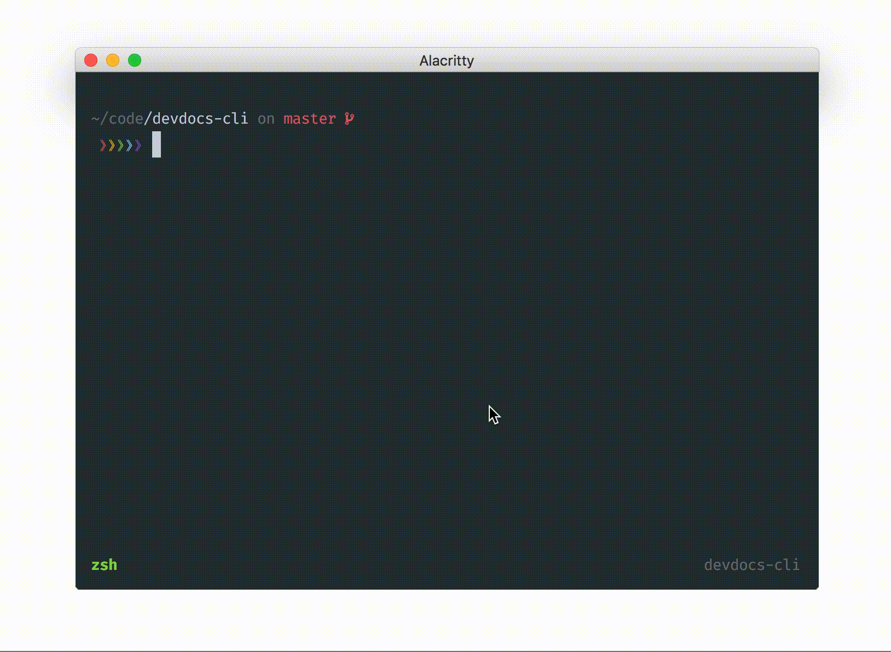

<h2 align="center">devdocs-cli</h2>

<p align="center">
  
</p>

# Installation

```
$ npm i -g devdocs-cli
```

# Usage

Either search for both docs and pages with:

```
$ devdocs

  Search Docs: 
  
  Search Pages: 
```

or if you already know the docs slug, use:

```
$ devdocs <lang-slug>

  Search Pages:
```

## Contributing

See: [CONTRIBUTING.md](CONTRIBUTING.md)

## License (ISC)
In case you never heard about the ISC license it is functionally equivalent to the MIT license.

See: [LICENCE.md](LICENSE.md)
